# 🏗️ Architecture: The Mini Assistant Complete (Script 09)
🌍 **English** | 📖 [Français](../fr/INDEX_SCRIPT_09.md) | 🇪🇸 [Español](../es/INDEX_SCRIPT_09.md) | 🇧🇷 [Português](../pt/INDEX_SCRIPT_09.md) | 🇸🇦 [العربية](../ar/INDEX_SCRIPT_09.md)
> **Complete breakdown** of the integrator project  
> Understanding the technical structure: layers, components, flow

---

## 📍 Quick Navigation

- **📖 See: [Pedagogical Journey](PEDAGOGICAL_JOURNEY.md)** - How it connects to chapters
- **⚡ See: [Quick Start](QUICKSTART_SCRIPT_09.md)** - Run it in 5 minutes
- **🔗 See: [Mapping Code ↔ Concepts](SCRIPT_09_MAPPING.md)** - Which code teaches what
- **🌍 Français: [Version Française](../fr/INDEX_SCRIPT_09.md)**

---

## 🎯 What's Inside?

Script 09 demonstrates ALL concepts from chapters 11-15:

| Chapter | Concept | Component in Script 09 |
|---------|---------|----------------------|
| 11 | Generation + Temperature | `generate_with_temperature()` |
| 12 | Chain-of-Thought | `reasoning_phase()` |
| 13 | RAG + Retrieval | `retrieve_documents()` |
| 14 | ReAct Agents | `agent_loop()` |
| 15 | Evaluation | `evaluate_response()` |

---

## 🏗️ Technical Architecture

### Layer 1: Data Layer
```
Knowledge Base (in-memory)
    ↓
Document Chunking
    ↓
Vector Embeddings (numpy)
```

**Responsibility:** Store and index knowledge
**Code location:** `load_knowledge_base()`, `embed_documents()`

---

### Layer 2: Retrieval Layer (RAG)
```
User Query
    ↓
Embed Query
    ↓
Similarity Search (cosine)
    ↓
Retrieved Contexts
```

**Responsibility:** Find relevant documents
**Code location:** `retrieve_documents()`

**Key Function:**
```python
def retrieve_documents(query: str, k: int = 3) -> list:
    # 1. Embed the query
    # 2. Compute similarity with all documents
    # 3. Return top-k most relevant
```

---

### Layer 3: Reasoning Layer (Chain-of-Thought)
```
Question
    ↓
Step 1: Analyze problem
Step 2: Retrieve context
Step 3: Think step-by-step
    ↓
Reasoning Trace
```

**Responsibility:** Structure thinking
**Code location:** `reasoning_phase()`

---

### Layer 4: Generation Layer (LLM-like)
```
Reasoning Trace + Context
    ↓
Token Selection (softmax)
    ↓
Temperature Sampling
    ↓
Response Generation
```

**Responsibility:** Create text
**Code location:** `generate_with_temperature()`

---

### Layer 5: Agent Layer (ReAct)
```
Agent Decision (Think)
    ↓
Tool Selection (Act)
    ↓
Observe Result
    ↓
Loop until done
```

**Responsibility:** Autonomous execution
**Code location:** `agent_loop()`

---

### Layer 6: Evaluation Layer
```
Generated Response
    ↓
Multiple Metrics (BLEU, Embedding Similarity, Coherence)
    ↓
Score (0-100)
```

**Responsibility:** Quality assessment
**Code location:** `evaluate_response()`

---

## 🔄 Complete Execution Flow

```mermaid
graph TD
    A["📥 User Input"] --> B["🔍 Retrieve Documents"]
    B --> C["💭 Reasoning Phase"]
    C --> D["🤖 Generate Response"]
    D --> E["🎯 Agent Evaluation"]
    E --> F["📊 Compute Metrics"]
    F --> G["📤 Return Result"]
```



**Step by step:**

1. **Input Processing**
   - Parse user query
   - Prepare for retrieval

2. **Retrieval (RAG)**
   - Find relevant context from knowledge base
   - Return top-3 documents

3. **Reasoning**
   - Create thinking chain
   - Analyze problem step-by-step
   - Include retrieved context

4. **Generation**
   - Select tokens using softmax
   - Apply temperature sampling
   - Build response iteratively

5. **Agent Loop**
   - Decide: continue or stop?
   - Select tool if needed
   - Execute and observe

6. **Evaluation**
   - Compute 5 quality metrics
   - Return scored result

7. **Return**
   - Present response to user
   - Show metrics and trace

---

## 📦 Main Functions

### `load_knowledge_base() → dict`
```python
# Returns dictionary of documents
{
    'doc_1': "Content about AI...",
    'doc_2': "Content about LLMs...",
    ...
}
```

---

### `embed_documents(docs: dict) → np.ndarray`
```python
# Returns (num_docs, embedding_dim) matrix
# Simple: Hash-based embeddings for demo
# Real: Use SentenceTransformer embeddings
```

---

### `retrieve_documents(query: str, k: int = 3) → list`
```python
# Input: "What is an LLM?"
# Output: [
#   {'doc': 'doc_1', 'content': '...', 'similarity': 0.87},
#   {'doc': 'doc_2', 'content': '...', 'similarity': 0.76},
#   {'doc': 'doc_3', 'content': '...', 'similarity': 0.68}
# ]
```

---

### `reasoning_phase(question: str, contexts: list) → str`
```python
# Input: question + retrieved contexts
# Output: Structured thinking trace
"""
Step 1: Analyze the question
The user asks about LLMs...

Step 2: Identify key concepts
Concepts: architecture, training, inference...

Step 3: Retrieve relevant context
From document X, we know that...

Step 4: Synthesize
Combining the knowledge, we can conclude...
"""
```

---

### `generate_with_temperature(prompt: str, temp: float = 1.0) → str`
```python
# Low temperature (0.3): deterministic, focused
# Medium temperature (1.0): balanced
# High temperature (2.0): creative, diverse

# Returns generated text segment
```

---

### `agent_loop(initial_query: str, max_turns: int = 3) → dict`
```python
# Agentic execution
# Each turn: Think → Act → Observe

# Returns: {
#   'answer': 'Final response',
#   'turns': 3,
#   'trace': ['Turn 1: ...', 'Turn 2: ...', ...]
# }
```

---

### `evaluate_response(response: str, context: str) → dict`
```python
# Computes 5 metrics:
# - Length ratio
# - Vocabulary overlap (BLEU)
# - Embedding similarity
# - Coherence score
# - Overall quality (0-100)

# Returns: {
#   'metrics': {'bleu': 0.75, 'similarity': 0.82, ...},
#   'quality_score': 79,
#   'interpretation': 'Good response...'
# }
```

---

## 🔗 Component Dependencies

```
User Query
    ↓
load_knowledge_base()  ← Initialize once
    ↓
embed_documents()      ← Initialize once
    ↓
retrieve_documents()
    ↓
reasoning_phase()
    ↓
generate_with_temperature()
    ↓
agent_loop()
    ↓
evaluate_response()
    ↓
Return Results
```

---

## ⚙️ Configuration & Parameters

| Parameter | Default | Range | Effect |
|-----------|---------|-------|--------|
| `TEMPERATURE` | 1.0 | 0.0-2.0 | Creativity control |
| `K_DOCUMENTS` | 3 | 1-10 | Context size |
| `MAX_TURNS` | 3 | 1-10 | Agent iterations |
| `EMBEDDING_DIM` | 128 | 64-512 | Embedding size |

**How to modify:**
```python
# In script 09
TEMPERATURE = 1.5        # More creative
K_DOCUMENTS = 5          # More context
MAX_TURNS = 5            # More agent iterations
```

---

## 💡 Key Implementation Details

### Embeddings (Simplified Demo)
```python
# Real production: SentenceTransformer
# Demo version: Hash-based (deterministic, fast)

def simple_embedding(text: str, dim: int = 128) -> np.ndarray:
    hash_val = hash(text)
    np.random.seed(abs(hash_val) % 2**32)
    return np.random.randn(dim)
```

---

### Temperature Sampling
```python
# Temperature = scaling factor for softmax
# logits = [1.0, 2.0, 0.5]
# 
# T=0.5: softmax(logits / 0.5) → sharper [0.1, 0.87, 0.03]
# T=1.0: softmax(logits / 1.0) → normal [0.09, 0.67, 0.24]
# T=2.0: softmax(logits / 2.0) → flatter [0.28, 0.38, 0.34]
```

---

### Chain-of-Thought Prompting
```
Instead of: "What is X?"
Better:     "Let's think step-by-step:
             1. Define the concept
             2. Break it down
             3. Provide examples
             4. Conclude"
```

---

### ReAct Loop Implementation
```python
while not done and turns < max_turns:
    # THINK: Analyze current state
    thought = analyze_state(context)
    
    # ACT: Choose and execute tool/action
    action = select_action(thought)
    result = execute_action(action)
    
    # OBSERVE: Update knowledge
    observation = observe_result(result)
    
    turns += 1
```

---

## 🎯 Learning Outcomes

After studying this architecture, you understand:

✅ How RAG integrates retrieval with generation  
✅ How temperature affects model behavior  
✅ How Chain-of-Thought improves reasoning  
✅ How agents make autonomous decisions  
✅ How to evaluate generation quality  
✅ How to combine all these concepts into one system

---

## 🚀 Next Steps

1. **Run it:** [Quick Start Guide](QUICKSTART_SCRIPT_09.md)
2. **Understand code:** [Code ↔ Concept Mapping](SCRIPT_09_MAPPING.md)
3. **Adapt it:** Modify for your use case
4. **Extend it:** Add more tools, better embeddings, etc.

---

**Ready to dive deeper? 📚**
